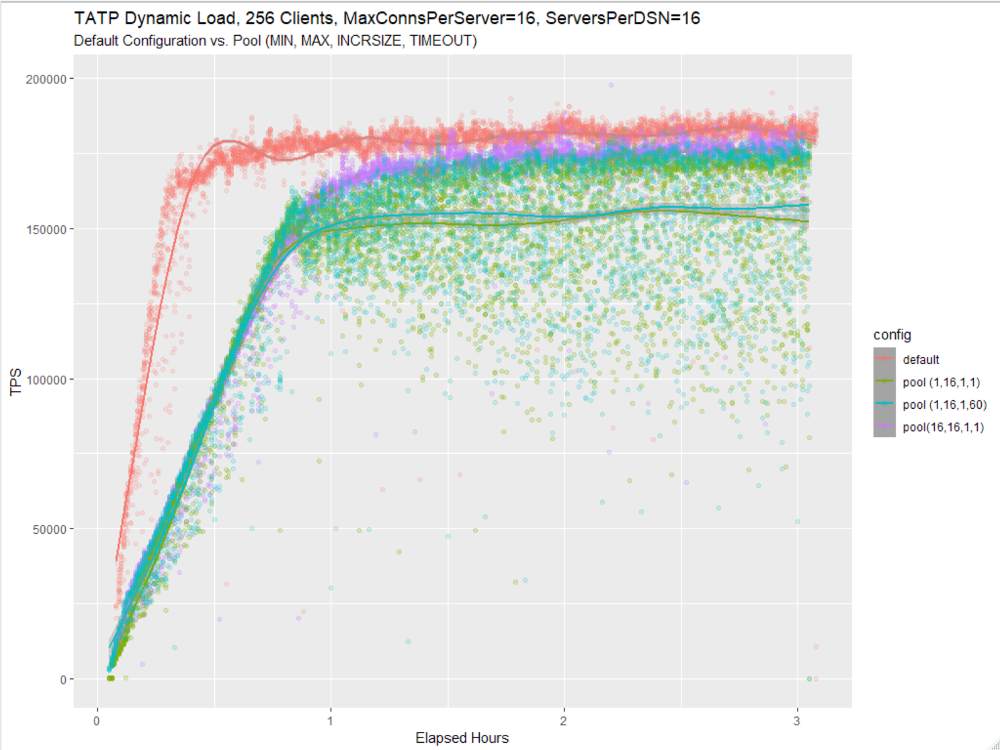
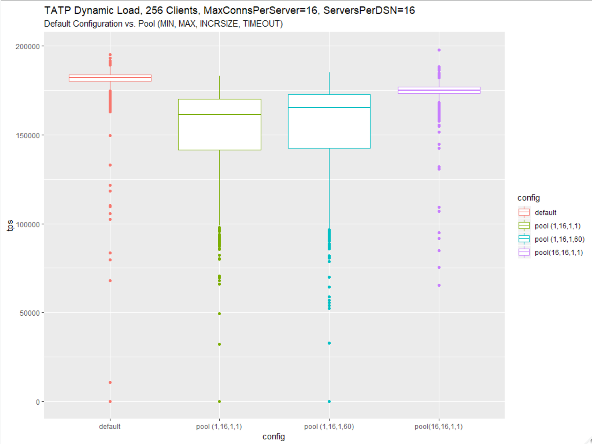
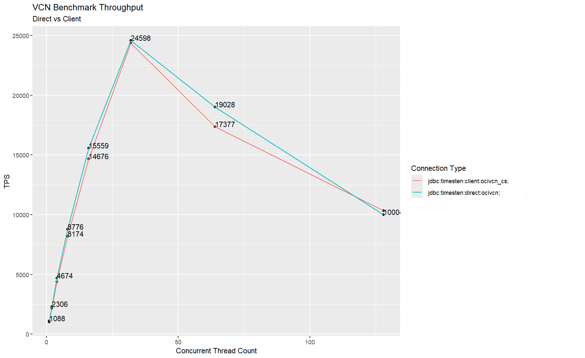
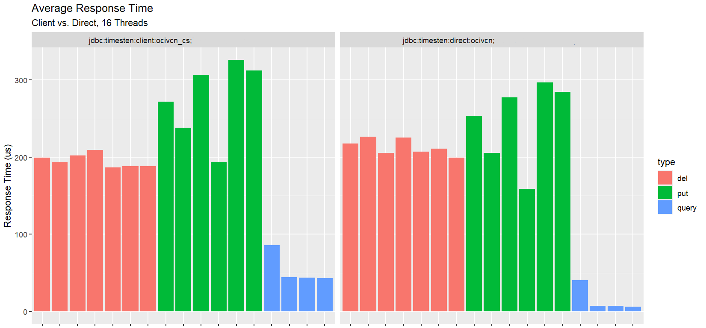

# Performance

Here are some examples of the results from database performance studies. These plots, and the associated data, were processed in the R language using the ggplot2 package.

------------------------------------------------------------------------

The plot below was created using data collected during a connection pool test for an application that caches data from a back-end database. As the cache fills over time, performance improves for all configurations. But the *default* (red) configuration performs best because it is not constrained by the limits of a connection pool.

------------------------------------------------------------------------

This plot uses the same data as above, but instead of a time series, the data is compared using box plots which clearly show the performance variation for each configuration.

------------------------------------------------------------------------

This plot shows how application throughput changes as the number of workload threads increase for two different database drivers.

------------------------------------------------------------------------

Based on the same test as above, this plot shows how average transaction response times vary for different database drivers and transaction types. In this case query transactions (blue) perform best followed by delete (red) and then insert (green) transaction types.

------------------------------------------------------------------------

These box plots show how a workload executing on each node (instance) of a distrubted database perform over a long duration load test. The nodes are ordered from left to right based on the median TPS measurement for each node.

